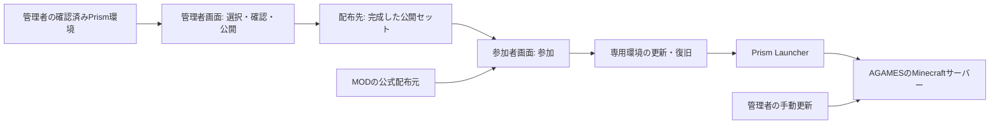

# 設計案

作成日：2026-09-09。要件は[要件定義](requirements.md)、具体的な方式はこの文書の推奨案。アプリの実装・実機検証はまだ行っていない。

## 全体構成

Windowsアプリに参加者向け画面と管理者向け画面を設ける。同期・復旧の処理を画面から分け、同じ処理を自動テストからも呼べるようにする。



配布用URLとMinecraft接続先は別設定にする。配布元の移転でも専用インスタンス・管理対象の履歴・個人追加分を引き継ぐ。

## 技術の推奨案

**C#／.NET 10＋WPF**を第一候補とする。初期版がWindows専用であり、画面、ローカルファイルの扱い、Prismのプロセス連携を一つの言語でまとめられる。WPFを同期処理から切り離し、将来別の画面を使う場合にも中核を再利用できるようにする。

比較したFlutterは、既存のDart経験や複数OSの画面展開が利点になる。今回は他OS対応を初期要件としていないためWPFを優先するが、同期性能や復元の安全性に優劣があると測定したわけではない。

.NET 10はLTS。利用者向けには.NETランタイムを同梱する配布方式を候補とし、配布量・更新方法を実装時に確定する。開発PCでは`dotnet --list-sdks`にSDKが表示されなかったため、実装前にSDK導入が必要である。[WPF公式](https://learn.microsoft.com/en-us/dotnet/desktop/wpf/overview/)、[.NETサポート方針](https://dotnet.microsoft.com/en-us/platform/support/policy/dotnet-core)、[.NET配布方式](https://learn.microsoft.com/en-us/dotnet/core/deploying/)、[Flutter Windows](https://docs.flutter.dev/platform-integration/windows/building)

## ModuleとInterface

ModuleのInterfaceは、画面がファイル操作の手順を組み立てなくて済む大きさにする。責務ごとに多数の空のプロジェクトを作らず、まず3つの製品プロジェクトへまとめる。

| Module | 呼び出し側へ見せるInterfaceの例 | 内部でまとめて扱う内容 |
| --- | --- | --- |
| 配布セット作成・公開 | `PrepareRelease(selection)`、`Publish(preparedRelease)` | 読取時点の固定、依存関係・取得経路の確認、公開前後の検証 |
| 参加準備 | `PrepareToJoin(instance, source)`、`Resume(operation, userAction)` | 差分、取得、手動待ち、競合の選択、バックアップ、反映、復元 |
| 更新取消 | `UndoLastUpdate(instance)` | 対象の限定、更新後の変更との照合、復元、管理台帳の整合 |
| Prism連携 | `Import(pack)`、`Launch(instance, server)` | 実行ファイル・データルートの選択、確認操作、インスタンス識別、起動引数 |

名前と引数は設計例。実装前に状態と失敗の返し方を確定する。長い処理は状態イベントを返し、利用者の操作が必要な状態を画面へ通知する。画面の都合で中核の失敗を成功に変換しない。

Seamは外部依存が変わる場所に置く。配布先・取得元・Prismやファイル操作には製品用Adapterとテスト用Adapterを使う。将来対応だけのために、実装のないForge・Fabric用プロジェクトを先に量産しない。

## 配布データ

配布セットは次の情報を持つ。実際のJSON Schemaは最初の実装で固定する。

| 情報 | 意味 |
| --- | --- |
| `schemaVersion` | 読み取り側が解釈できる形式の版 |
| `packId` | 配布先の移転でも変えないセットの識別子 |
| `releaseId` | 公開後に内容を変えない、一回の公開の識別子 |
| `minecraft` / `loader` | MinecraftとNeoForgeの正確な版 |
| `server` | Minecraftの接続先。公開用の認証情報は含めない |
| `files` | 配置先相対パス、用途、バイト数、SHA-256、取得経路 |
| `resourcePackOrder` | 配布パックの優先順。並びの向きを形式で一意に定義 |
| `initialInstance` | 同じリリースから作るPrism初回取込データと照合情報 |

取得経路は「公式配布元からの取得」「配布用サーバー上のファイル」「手動取得」の三種類。外部MODの提供元ID・ファイルIDを保持し、自前配布はその配布方法を確認できたファイルに限定する。取得経路が確定できない必須ファイルは公開準備時に報告する。第三者取得が無効なファイルのCDN URLを推測して代用しない。

選択対象にはMOD ID・依存関係も読み取る。一つのJARに複数MODが含まれる場合があるため、MOD IDとファイルを一対一と決めつけない。ファイル名だけで同一MODを断定しない。

公開形式は共通に保ち、初期の取得をHTTPS、公開をSFTP＋静的ファイル配信とする案を推奨する。サーバー契約はこの文書では行わない。最終参照の切替を途中状態なく行えるかは、採用先で事前に実測する。

```text
配布ルート/
  current.json
  releases/<releaseId>/
    manifest.json
    initial-instance.zip
    files/...
  staging/<operationId>/...
```

`staging`は参加者向けの公開対象にしない。公開はアップロード・照合・リリース確定を済ませ、最後に`current.json`だけを切り替える。失敗時は以前の公開版を維持する。参加者は処理開始時に選んだ`releaseId`を完了まで固定し、途中の最新版変更で異なる版を混ぜない。公開先に必要な原子的切替や条件付き更新がなければ、そのまま成功保証を付けずAdapterの方式を見直す。

配布先の移転時は同じ`packId`を維持する。アプリで取得URLを変更できるようにし、未完了の処理と新しい取得先を混在させない。旧URLが消えても自動で新URLを発見できるとは保証しない。

## 初回の専用インスタンス

1. 準備済みのPrismを選ぶか、導入・初期設定・Microsoftログインを案内する。
2. 公開リリースと一致する初回取込データを取得・照合し、Prismの取り込み画面を開く。
3. 利用者が取り込みを確定する。表示名だけで既存の環境を同期先と判断しない。
4. 作成された専用インスタンスの実パス、Prismのデータルート、`packId`を結び付ける。
5. 配置済みファイルを確認し、実際に存在する構成と一致したときに管理台帳を確定する。

Prismの取り込み失敗・キャンセルは同期成功として扱わない。初回取り込み方式と作成後の識別は、最初に小さな検証用セットで実測する。[Prism CLI](https://prismlauncher.org/wiki/getting-started/command-line-interface/)

## 更新の流れ

```text
配布版の固定 → 構成の調査 → 差分と衝突の判定
 → 必要ファイルの取得・照合（手動取得待ちを含む）
 → 対象ゲーム停止・空き容量・対象パスの確認
 → 復元材料と処理記録の保存 → 反映 → 構成と台帳の確定
 → Prismへ起動・接続を依頼
```

- 二重クリックや複数プロセスから、同じインスタンスを同時更新しない。変更の直前にもゲームの停止状態と観測したファイルの一致を確認する。
- 取得完了前は稼働環境へ変更を加えない。保存途中のファイルは完了品として認識しない。
- 配布側のパスをそのまま信用しない。絶対パス、親への移動、Windowsの特殊パス、リンク経由の対象外書き込みを拒否する。
- 更新に必要なバックアップが作れなければ変更を始めない。適用処理の途中終了は次回起動時に検出し、復旧を先に行う。
- 復元自体が失敗した場合はゲーム起動を止め、復元材料を残して状況を表示する。

Minecraft・NeoForgeの版を記録する専用インスタンスのPrism構成も、MODと同じ更新・復旧・取消の対象に含める。NeoForgeだけ新版のままMODを旧版へ戻す状態を作らない。版指定に必要な構成だけを変更し、アカウント・Java・メモリ等の個人設定を丸ごと置き換えない。必要な本体・ライブラリーの準備と指定版の確認をどの段階で行えるかはPrism連携の実現性検証で確定し、準備失敗を参加準備の成功として扱わない。

管理台帳は「前回配布したもの」を追跡する。管理対象だったMOD・パックだけが削除候補になる。指定から外れたコンフィグは残して管理を終了する。個人ファイルとの同一パス衝突は、無関係なファイルの無断上書きにつながらないよう個別に判定する。

同じ必須MODの別版は管理者の版へ揃える。それ以外の個人MODとの競合が確認できた場合は、理由と対象を表示し、本人の選択後に一時退避する。退避後も依存不足等が残るなら起動しない。原因不明のクラッシュを特定の個人MODのせいと断定しない。

## 手動取得

不足するMOD名・版と、その版のダウンロード開始リンクを示す。標準のダウンロードフォルダーを監視し、別の保存先の指定とファイルのドラッグ＆ドロップを補助手段とする案にする。

候補は期待ハッシュと照合する。名前の一致だけで完了にしない。全件揃えば余分な「続行」のクリックを要求せず、待機中だった処理を再開する。リンク先の待ち時間・保存確認・再認証などは案内するが、サイト側の制限を回避する機能にしない。[Prismの手動取得実装](https://github.com/PrismLauncher/PrismLauncher/blob/11.1.0/launcher/ui/dialogs/BlockedModsDialog.cpp)

## リソースパックと設定

ファイル単位のコンフィグ同期は管理者選択に従う。これに加えて、リソースパックの自動有効化・優先順を実現する処理だけが、関連する設定項目を変更する。対象と変更内容を公開内容の確認画面に明示する。

- `options.txt`を丸ごと配布する方式を既定にしない。管理対象パックの有効化・無効化・順序に必要な項目だけを編集する。
- 無関係な画面・音量・キー設定、個人パック同士の順序、組込・生成パックの項目を保持する。
- 配布順は「配布パックが個人パックより優先」という要件へ変換する。ファイル内の配列順と画面上の上下の対応は対象版で検証する。
- 基準環境のResource Pack Overridesにも既定一覧がある。初回や読込失敗で古い既定一覧へ戻らないよう、この設定と配布内容の整合を取る。

同じ設定ファイルを「ファイル丸ごとの同期」と「パック設定の自動編集」の両方で管理しない。自動編集に使うファイルは通常の丸ごと配布の選択対象から外し、管理者画面で理由と編集対象の項目を示す。重複した指定を含む配布データは公開・適用前に拒否する。通常の指定ファイルは配布ハッシュとの一致で、自動編集するファイルは管理項目の期待値と変更対象外の保持で検証する。自動編集後のファイルに配布元の丸ごとハッシュを要求しない。

基準環境の`resourcepacks`にはデータパックもある。Global Packsの設定がその場所をデータパックの読込先としており、Paxiにも一部が重複配置されている。ZIPの用途を内容で分類し、データZIPを視覚用パックとして有効化しない。独立したデータパック配布画面の追加は初期要件としていない。必要ファイルの具体的な選定は、管理者のサーバー準備と実参加で確認する。[Resource Pack Overrides 1.21.1](https://github.com/Fuzss/resource-pack-overrides/blob/1.21.1/README.md)、[Global Packs](https://www.curseforge.com/minecraft/mc-mods/globalpacks)、[Paxi](https://www.curseforge.com/minecraft/mc-mods/paxi)

FTB Questsはサーバーから参加時にクエスト本・翻訳を送る。参加者側の定義ファイルの上書きだけでマルチプレイ中の内容を決めようとしない。ワールドや進捗を同期対象へ入れない。[FTB Quests 2101.1.24](https://github.com/FTBTeam/FTB-Quests/blob/v2101.1.24/common/src/main/java/dev/ftb/mods/ftbquests/quest/ServerQuestFile.java)

## 取消と個人変更の保護

取消用のバックアップは、実際に構成を変えた成功済み更新の直前1回分を保持する。無変更の確認や失敗した更新によって、この1回分を捨てない。進行中の更新を復旧する記録と、成功後の取消記録は別の目的で保持する。

取消は前回更新が触った範囲に限定する。更新後に増えた個人MODや指定外設定をインスタンス全体の復元で消さない。同じ対象ファイルが更新後にも変更されていた場合は、現在内容を退避できる形で差分を提示し、黙って失わせない。

個人MODの一時退避ファイルは取消用1世代とは別に保管する。次の更新が成功したという理由で自動削除しない。復元時に競合が再発する場合は説明して再確認する。

取消直後は自動参加や自動再更新を実行しない。次回「参加」を選んだ場合は公開セットを再確認し、戻した版と必要な版が違うことを示す。現在必要な版への更新ができなければ、古い構成で参加処理を開始しない。

## 状態表示と画面

参加者画面の中心は「参加」。通常は配布版、専用環境、進捗、現在の状態を示す。補助操作として初回案内、手動取得、個人MODの一時退避と復元、更新取消、ログの表示・保存を用意する。

管理者画面は基準インスタンス、配布対象選択、設定の選択、パック順、取得経路確認、変更内容確認、公開状況を扱う。公開用の認証情報は管理者だけが持ち、共有リンクや配布ファイルへ含めない。

状態は「構成確認済み」「Prismへ起動依頼済み」「ゲーム起動を確認」「参加を確認」を区別する。ファイル一致やプロセス起動だけで参加成功と表示しない。参加成功の観測方法はPrism・ゲームの実動作で検証する。信頼できる観測が得られない場合は、確認できた段階をそのまま表示する。接続失敗は構成破損と断定して自動取消しない。

## 実装前の確認事項

Prismの初回連携、設定の編集対象、公開先の切替特性、外部MODの取得経路が未検証である。これらの確認を先に行い、推奨方式を採用できない場合は、要件への影響を説明して設計を更新する。実サーバーの契約・接続先・公開用の認証情報は、配布環境を準備する段階で設定する。
