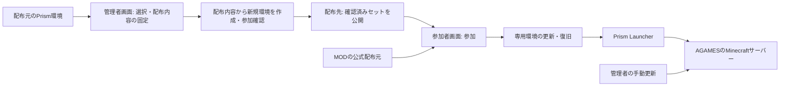

# 設計案

作成日：2026-09-09。更新日：2026-10-04。要件は[要件定義](requirements.md)、具体的な方式はこの文書の設計案。設計レビューに基づき公開前の参加検証、起動前の最新版確認、複数MOD入りJARの扱いを改訂した。開発基盤と最小アプリの起動確認に加え、Issue #12の初回取り込みと識別（案A）の製品処理・検証用入口・自動試験を追加した。実Prismでの確認、同期・更新・公開の実装、実参加の検証はまだ行っていない。この方式の実機での確認結果は、検証後に別途記録する。

## 全体構成

Windowsアプリに参加者向け画面と管理者向け画面を設ける。同期・復旧の処理を画面から分け、同じ処理を自動テストからも呼べるようにする。


```mermaid
flowchart LR
    A[配布元のPrism環境] --> B[管理者画面: 選択・配布内容の固定]
    B --> V[配布内容から新規環境を作成・参加確認]
    V --> C[配布先: 確認済みセットを公開]
    C --> D[参加者画面: 参加]
    E[MODの公式配布元] --> D
    D --> F[専用環境の更新・復旧]
    F --> G[Prism Launcher]
    G --> H[AGAMESのMinecraftサーバー]
    I[管理者の手動更新] --> H
```

配布用URLとMinecraft接続先は別設定にする。配布元の移転でも専用インスタンス・管理対象の履歴・個人追加分を引き継ぐ。

## 技術の推奨案

**C#／.NET 10＋WPF**を第一候補とする。初期版がWindows専用であり、画面、ローカルファイルの扱い、Prismのプロセス連携を一つの言語でまとめられる。WPFを同期処理から切り離し、将来別の画面を使う場合にも中核を再利用できるようにする。

比較したFlutterは、既存のDart経験や複数OSの画面展開が利点になる。今回は他OS対応を初期要件としていないためWPFを優先するが、同期性能や復元の安全性に優劣があると測定したわけではない。

.NET 10はLTS。開発基盤ではSDK 10.0.401を固定し、[セットアップ手順](development.md)でユーザー専用領域に導入する。利用者向けには.NETランタイムを同梱する配布方式を候補とし、配布量・更新方法を実装時に確定する。現在の最小アプリは開発用SDKのランタイムで動作し、利用者向けの配布物ではない。[WPF公式](https://learn.microsoft.com/en-us/dotnet/desktop/wpf/overview/)、[.NETサポート方針](https://dotnet.microsoft.com/en-us/platform/support/policy/dotnet-core)、[.NET配布方式](https://learn.microsoft.com/en-us/dotnet/core/deploying/)、[Flutter Windows](https://docs.flutter.dev/platform-integration/windows/building)

## ModuleとInterface

ModuleのInterfaceは、画面がファイル操作の手順を組み立てなくて済む大きさにする。責務ごとに多数の空のプロジェクトを作らず、まず3つの製品プロジェクトへまとめる。

| Module | 呼び出し側へ見せるInterfaceの例 | 内部でまとめて扱う内容 |
| --- | --- | --- |
| 配布セット作成・公開 | `PrepareRelease(selection)`、`VerifyRelease(preparedRelease)`、`Publish(verifiedRelease)` | 読取時点の固定、依存関係・取得経路の確認、検証用環境の作成、内容に紐付く参加確認、公開前後の照合 |
| 参加準備 | `PrepareToJoin(instance, source)`、`Resume(operation, userAction)` | 差分、取得、手動待ち、競合の選択、バックアップ、反映、復元、起動前の最新版確認と追従回数 |
| 更新取消 | `UndoLastUpdate(instance)` | 対象の限定、更新後の変更との照合、復元、管理台帳の整合 |
| Prism連携 | `Import(pack)`、`Launch(instance, server)` | 実行ファイル・データルートの選択、確認操作、インスタンス識別、起動引数 |

Prism連携の`Import(pack)`は、初回の専用インスタンスについて次の形に具体化する。判定と状態遷移は`ModSync.Core/InstanceSetup`に置き、Prismのフォルダー観測・ファイル読み取り・プロセス起動・記録の保存は`ModSync.Platform`のAdapter（`Prism/`、`FileSystem/`）が担う。Coreはファイル列挙・INI解析・`Process`を持たない。

| 呼び出し側へ見せるInterfaceの例 | 返すもの |
| --- | --- |
| `StartAsync(input, progress)` | 試行の状態イベント。最後は終端状態 |
| `RegisterAsync(operationId)` | 照合済みの場合だけ確定へ進み、`Registered`・`AlreadyRegistered`・失敗状態のいずれか |
| `RecheckAsync(operationId)` | 途中終了や遅れて完了した取り込みの再確認結果。確定登録とは区別する |
| `CheckReadinessAsync(operationId)` | Minecraft・ローダーの準備段階と不足一覧 |

Seamは`IPrismImportGateway`（取り込み前一覧の取得、依頼、候補の観測、準備状況の採取）と`IImportRecordStore`（処理記録・登録台帳・排他ロック）とする。テストでは偽のAdapterと一時ディレクトリを使い、通常の自動テストで実Prismを呼ばない。

名前と引数は設計例。実装前に状態と失敗の返し方を確定する。長い処理は状態イベントを返し、利用者の操作が必要な状態を画面へ通知する。画面の都合で中核の失敗を成功に変換しない。

Seamは外部依存が変わる場所に置く。配布先・取得元・Prismやファイル操作には製品用Adapterとテスト用Adapterを使う。将来対応だけのために、実装のないForge・Fabric用プロジェクトを先に量産しない。

## 配布データ

配布セットは次の情報を持つ。実際のJSON Schemaは最初の実装で固定する。

| 情報 | 意味 |
| --- | --- |
| `schemaVersion` | 読み取り側が解釈できる形式の版 |
| `packId` | 配布先の移転でも変えないセットの識別子 |
| `releaseId` | 公開後に内容を変えない、一回の公開の識別子 |
| `minecraft` / `loader` | MinecraftとNeoForgeの正確な版 |
| `server` | Minecraftの接続先。公開用の認証情報は含めない |
| `files` | 配置先相対パス、用途、バイト数、SHA-256、取得経路 |
| `resourcePackOrder` | 配布パックの優先順。並びの向きを形式で一意に定義 |
| `initialInstance` | 同じリリースから作るPrism初回取込データと照合情報 |

取得経路は「公式配布元からの取得」「配布用サーバー上のファイル」「手動取得」の三種類。外部MODの提供元ID・ファイルIDを保持し、自前配布はその配布方法を確認できたファイルに限定する。取得経路が確定できない必須ファイルは公開準備時に報告する。第三者取得が無効なファイルのCDN URLを推測して代用しない。

選択対象にはMOD ID・依存関係も読み取る。一つのトップレベルJARが複数の`[[mods]]`を宣言できるため、MOD IDとファイルを一対一と決めつけない。ファイル名だけで同一MODを断定しない。ファイルごとに全MOD ID・版・依存関係・ハッシュ・管理区分を保持し、差分を作る前にファイルを除いた場合の全影響を判定する。[NeoForge 1.21.1のMODメタデータ仕様](https://docs.neoforged.net/docs/1.21.1/gettingstarted/modfiles/)

公開形式は共通に保ち、初期の取得をHTTPS、公開をSFTP＋静的ファイル配信とする案を推奨する。サーバー契約はこの文書では行わない。最終参照の切替を途中状態なく行えるかは、採用先で事前に実測する。

```text
配布ルート/
  current.json
  releases/<releaseId>/
    manifest.json
    initial-instance.zip
    files/...
  staging/<operationId>/...
```

`staging`は参加者向けの公開対象にしない。公開はアップロード・照合・リリース確定を済ませ、最後に`current.json`だけを切り替える。失敗時は以前の公開版を維持する。`current.json`は`packId`・`releaseId`・manifestのSHA-256を持つ。参加者は一回の更新処理中、この組を固定し、途中の最新版変更で異なる版を混ぜない。構成確定後は起動直前に最新版を再確認し、変更があれば別の更新処理へ進む。公開先に必要な原子的切替や条件付き更新がなければ、そのまま成功保証を付けずAdapterの方式を見直す。

配布先の移転時は同じ`packId`を維持する。アプリで取得URLを変更できるようにし、未完了の処理と新しい取得先を混在させない。旧URLが消えても自動で新URLを発見できるとは保証しない。

## 配布内容の検証と公開

管理者の元インスタンスは選択元であり、公開可否を判断する検証用環境とは分ける。配布セット作成・公開Moduleが次の状態を管理し、画面の「確認済み」表示だけで公開を許可しない。

| 状態 | 次へ進む条件 |
| --- | --- |
| 編集中 | 選択したファイル・版・取得経路・設定・パック順・接続先を確認し、内容を固定する |
| 検証待ち | 固定したmanifestと初回取込データから新しい検証用インスタンスを作り、取得・適用・照合を完了する |
| 参加確認待ち | 管理者がそのインスタンスで対象サーバーへ参加し、必要な機能・設定の効果・パック・クエストを確認する |
| 検証済み | 確認対象と公開予定内容の一致を再照合できた場合だけ、アップロードと公開へ進む |
| 公開済み | 公開先での照合を終えて`current.json`を切り替えた状態。同じ版の内容は変更しない |

準備時に`releaseId`を割り当て、manifestの確定バイト列のSHA-256を計算する。manifestには配布ファイルと初回取込データのハッシュ、Minecraft・ローダー版、取得経路、設定の適用方法、パック順、接続先を含める。確認記録は`packId`・`releaseId`・manifestのSHA-256・検証用インスタンスの識別子・確認日時・確認項目と結果を持ち、manifestの外に保管する。記録自身をmanifestへ含めてハッシュが循環する形式にはしない。

検証用インスタンスには元環境の未選択MOD・設定を持ち込まない。参加者と同じ初回作成・取得・適用の処理を使い、公開前の固定済みセットを入力にする。未公開の自前ファイルは準備領域から読み、公式取得・手動取得は指定された経路を使う。照合済みキャッシュの再利用は認めるが、元インスタンスから不足ファイルを暗黙に補わない。配布用サーバーでの取得可否はアップロード後・公開切替前にも確認する。

共用するのは構成の作成・取得・適用・照合である。管理者の検証起動は固定した未公開セットを対象にし、参加者用の`current.json`への追従を適用しない。検証用として識別したインスタンスだけをこの経路で起動し、参加者の通常参加に最新版確認を省略する選択肢は設けない。

ファイル照合やPrismへの起動依頼だけで参加確認を済ませない。実参加と内容確認は管理者本人の操作を許容し、ツールが観測した結果と本人が確認した結果を区別して保存する。確認を記録するときはゲームを終了し、管理対象の照合を再実行する。通常ファイルのハッシュ、自動編集する設定の管理項目、MOD構成・版が期待と異なる場合は検証済みにしない。未選択ファイルを足して解決した場合も、選択と固定からやり直す。

配布内容の変更は新しい準備版として扱い、前の確認記録を引き継がない。公開処理は固定済みデータを読み、元インスタンスを再収集しない。検証後の差し替え・不足・照合失敗は公開を止める。サーバー側の構成を確認後に変更した場合も管理者が確認を無効化して再検証する。サーバー変更をツールが自動検出できるとは扱わない。検証失敗・中断・公開失敗で旧公開版は変更しない。

## 初回の専用インスタンス

1. 準備済みのPrismを選ぶか、導入・初期設定・Microsoftログインを案内する。
2. 公開リリースと一致する初回取込データを取得・照合し、Prismの取り込み画面を開く。
3. 利用者が取り込みを確定する。表示名だけで既存の環境を同期先と判断しない。
4. 作成された専用インスタンスの実パス、Prismのデータルート、`packId`を結び付ける。
5. 配置済みファイルを確認し、実際に存在する構成と一致したときに管理台帳を確定する。

Prismの取り込み失敗・キャンセルは同期成功として扱わない。初回取り込み方式と作成後の識別は、最初に小さな検証用セットで実測する。[Prism CLI](https://prismlauncher.org/wiki/getting-started/command-line-interface/)

### 取り込みと識別の方式（Issue #12、案A）

取り込み前後の`instances`の差分、`mmc-pack.json`の照合、取り込み入力に含めた識別ファイルを併用する。`instance.cfg`への自前の項目の追加や、利用者によるインスタンスIDの選択には頼らない。根拠はPrism 11.1.0の公式ソース（`InstanceImportTask.cpp`、`modplatform/modrinth/ModrinthInstanceCreationTask.cpp`、`InstanceList.cpp`）であり、実機での挙動はIssue #12の検証で記録する。

- **入力**: 試行ごとに新しい`operationId`（UUIDv4）を割り当て、MODを含まないmrpackを作る。中身は`modrinth.index.json`（`files`は空、`dependencies`にMinecraftとNeoForgeのバージョン）、`overrides/modsync/identity.json`（`schemaVersion`・`packId`・`operationId`・用途）、小さな検証ファイル。バージョンは入力定義から読み、アプリの定数にしない。初回の検証入力はMinecraft 1.21.1／NeoForge 21.1.228とする。識別ファイルにアーカイブ自身のハッシュを含めない。取り込み依頼の前に、アーカイブと各ファイルのSHA-256を処理記録へ保存する。
- **データルート**: Prismのデータルートを明示し、`--dir`と`--import`を引数リストで渡す。Prismの設定ファイルとアカウント情報は読まない。`instances`の場所が想定と違えば止める。
- **候補の絞り込み**: 依頼直前に`instances`直下の全エントリー（隠し・空フォルダー・`.tmp`を含む）を記録する。記録にあったパスは候補から必ず除く。`.`で始まる名前、リパースポイント、`instance.cfg`のないフォルダーも除く。表示名・更新日時では選ばない。
- **照合**: 候補ごとに、ゲームルート（`minecraft`か`.minecraft`のどちらか一方）配下の識別ファイル、Prismが保持する`mrpack/modrinth.index.json`、検証ファイルのSHA-256と、`mmc-pack.json`の`net.minecraft`・`net.neoforged`のバージョンを照合する。全項目が一致する候補がちょうど1件で、内容が連続して変化しなくなった場合だけ照合済みにする。一致が複数、または識別ファイルだけが一致して他が違う場合は登録しない。識別ファイルの一致は必須とし、保持された`modrinth.index.json`は追加の照合だけに使う。今回の取り込みと見られる候補で識別ファイルが欠損・不一致なら、登録を確定せず確認不能として止める。保持インデックスなど他の要素で代替しない。アプリはPrismのインスタンス内へ書き込まない。
- **パスの安全性**: 相対パス、UNC、デバイスパス、代替データストリーム、予約名、親への移動を拒否する。大文字小文字と短縮名は実在するエントリーから正規化する。データルートから読み取り対象までの各階層で、junction・シンボリックリンク等のリパースポイントを拒否する。
- **台帳の確定**: 照合済みの候補を確定直前に再照合する。処理記録を「確定中」にしてから、登録台帳を一時ファイルへ書き、置換し、読み戻して一致を確認した後だけ登録済みにする。同じ`packId`の台帳が別のインスタンスを指していれば上書きしない。保存失敗・読み戻し不一致は未確定のまま表示する。途中終了は次回の再確認で台帳の内容から判定する。
- **既存インスタンスの保護の証拠**: 既存インスタンスの再帰一覧と非機密ファイルのハッシュを、読み取りだけで段階ごとに採取して比較する。認証ファイルは対象外とする。Prismが既に動いていれば、その現在状態を取り込み前の基準にする。今回新たにPrismを起動する場合は、起動前にも採取し、起動後・取り込み後・準備確認後まで比較する。既存インスタンスの外側の共有の変化（`instgroups.json`等）は分けて記録する。既存インスタンスの内側の差分は、取り込みと無関係に見えても例外にしない。予期しない変更が見つかれば、以後の書き込みを伴う操作を止めて証拠を保全し、報告する。自動では復元しない。基準を採取できなかった範囲は未確認と明記し、全操作を通じて不変とは断定しない。
- **排他と再試行**: 同じデータルートの取り込みはロックで重ねない。未終了の試行が残っていれば、新しい取り込みより先に再確認する。終了後に遅れて現れた一致候補は、自動で登録も削除もせず、本人の操作で同じ照合を通したときだけ登録する。

登録台帳は`packId`、`operationId`、正規化したデータルート、インスタンスID（フォルダー名）、実パス、入力のハッシュ、照合したコンポーネントとファイル、確定日時を持ち、表示名は補助情報とする。処理記録（入力のハッシュ、取り込み前一覧、観測した状態と理由、本人の申告）は台帳とは別に保持する。どちらもアプリのローカルデータ領域に置き、Prismのデータルートとは分ける。実パスを含む記録は公開しない。

**「準備された」の判定**は段階に分ける。(1) `mmc-pack.json`のバージョン記述が一致する、(2) Prismのメタデータ索引のハッシュとバージョン定義が一致する、(3) バージョン定義に記載された公式のsha1で、必要な本体・ライブラリーの実ファイルが一致する、(4) NeoForgeのインストーラー処理が必要な場合は、その生成物がインストーラー定義のsha1と一致する。(4)まで確認できた場合だけ準備完了とする。`libraries`フォルダーの存在やバージョン記述だけでは準備完了にしない。Prismのソース上、取り込み処理は本体・ライブラリーを取得しないため、取り込み直後は(1)または(2)に留まる見込みである。登録（データルート・実パス・`packId`の結び付け）と準備完了は別に判定し、準備が完了していない状態を参加準備の成功として扱わない。

## 更新の流れ

```text
配布版の固定 → 構成の調査 → 差分と衝突の判定
 → 必要ファイルの取得・照合（手動取得待ちを含む）
 → 対象ゲーム停止・空き容量・対象パスの確認
 → 復元材料と処理記録の保存 → 反映 → 構成と台帳の確定
 → 公開中の版を再確認（一致: 起動へ、変更: 新しい更新へ、確認不能: 保留）
 → Prismへ起動・接続を依頼
```

- 二重クリックや複数プロセスから、同じインスタンスを同時更新しない。変更の直前にもゲームの停止状態と観測したファイルの一致を確認する。
- 取得完了前は稼働環境へ変更を加えない。保存途中のファイルは完了品として認識しない。
- 配布側のパスをそのまま信用しない。絶対パス、親への移動、Windowsの特殊パス、リンク経由の対象外書き込みを拒否する。
- 更新に必要なバックアップが作れなければ変更を始めない。適用処理の途中終了は次回起動時に検出し、復旧を先に行う。
- 復元自体が失敗した場合はゲーム起動を止め、復元材料を残して状況を表示する。

Minecraft・NeoForgeの版を記録する専用インスタンスのPrism構成も、MODと同じ更新・復旧・取消の対象に含める。NeoForgeだけ新版のままMODを旧版へ戻す状態を作らない。版指定に必要な構成だけを変更し、アカウント・Java・メモリ等の個人設定を丸ごと置き換えない。必要な本体・ライブラリーの準備と指定版の確認をどの段階で行えるかはPrism連携の実現性検証で確定し、準備失敗を参加準備の成功として扱わない。

管理台帳は「前回配布したもの」を追跡する。管理対象だったMOD・パックだけが削除候補になる。指定から外れたコンフィグは残して管理を終了する。個人ファイルとの同一パス衝突は、無関係なファイルの無断上書きにつながらないよう個別に判定する。

同じ必須MODの別版は管理者の版へ揃える。ただし個人JARに含まれる別のMODへも影響する場合は、次節の判定を先に行う。それ以外の個人MODとの競合が確認できた場合も、理由と対象を表示し、本人の選択後に一時退避する。退避後も依存不足等が残るなら起動しない。原因不明のクラッシュを特定の個人MODのせいと断定しない。

## 複数MOD入りJARと個人MODの保護

比較はMOD IDで行い、配置・退避・復元はJARファイル単位で行う。個人JARのトップレベルMOD IDの集合と、更新先の必須JAR全体が提供するMOD IDの集合を比較する。選択したJAR内の一部だけを配布対象にしたり、JARを分割・再梱包して解消したりしない。

| 個人JARの状態 | 判定と動作 |
| --- | --- |
| 全IDが更新先の必須MODに含まれる | 無関係な個人MODを失わないことを確認し、同一MODの版合わせとして自動調整する |
| 一部のIDだけが更新先の必須MODに含まれる | 必須指定と重なるMODと、一緒に無効になる個人MODをすべて示し、本人の選択を待つ。自動では退避しない |
| 必須MODとのID重複がない | 個人ファイルを保持する。別の競合が確認できたときだけR23の選択へ進む |
| MOD IDや包含関係を判定できない | 同一MODと推測して自動置換せず、理由を表示して構成の確認を求める |

例えば個人JARが「A 2.0とB」、必須JARが「A 1.0」なら、「Aを1.0へ揃えるため、このファイルを一時無効化するとBも使えなくなります」と説明する。本人がファイル全体の一時無効化を選んだ場合だけ退避を含む更新を計画し、選ばなければ稼働ファイルを変えず起動を保留する。画面にはファイル名と影響する全MOD名・IDを表示する。

ModCatalogは退避を含む更新後の構成全体について、確認可能な依存不足・版条件・重複を評価する。例えばBに依存する個人MOD Cが残るなら、Cまで無断で連鎖退避せず、追加の影響を説明して本人の選択を得る。解消する計画が成立するまでは反映を始めず、必要ファイルの照合とバックアップを終えてから計画全体を反映する。反映後も再確認し、計画と異なる構成なら起動せず更新前へ復旧する。

選択は更新先の版、対象の元パス・ハッシュ・全MOD ID、退避理由に紐付ける。反映直前に対象が変わっていたら判定と選択をやり直す。退避した実ファイルとその記録は、取消用の1世代とは別に保存する。復元先の衝突や必須MODとの競合を再確認してからファイル全体を戻し、無関係なファイルを上書きしない。

この集合比較はトップレベルの複数MOD宣言に適用する。Jar-in-Jarの内包依存をトップレベルMODの重複と同一視せず、対象ローダーでの扱いを別に確認する。以前からツールが管理していたJARの配布解除は管理台帳に基づく除外として扱い、個人JARへの判定と混同しない。

## 起動直前の最新版確認

参加準備Moduleは「構成の反映成功」と「起動へ進める状態」を区別する。参加者の初回準備後、無変更の参加、手動取得からの再開も、Prismへ起動を依頼する直前に同じ確認を通す。`current.json`は毎回配布先へ再検証を要求し、有効な応答を得る。ローカルキャッシュだけの参照や、通信失敗時の古い応答への代替では確認済みにしない。配信側のキャッシュ設定もこの再検証を妨げないことを実測する。

| 再確認の結果 | 次の動作 |
| --- | --- |
| 同じ`packId`・`releaseId`・manifestハッシュ | 構成の照合済み状態とゲーム停止を確認し、Prismへ起動・接続を依頼する |
| 同じ`packId`の別`releaseId` | 今回の構成確定を維持し、新しい版を固定した別の更新処理を開始する。旧版では起動しない |
| 取得失敗、不正な形式、別`packId`、同一`releaseId`のハッシュ変更 | 起動を保留し、理由と再試行方法を表示する。成功済み構成と取消材料は保持する |

別の更新処理では、新版のmanifestの照合から差分・取得・競合判定をやり直す。旧版での個人MOD退避への選択を、新しい対象への許可として流用しない。取得済みファイルは新版の期待ハッシュと一致するものだけ再利用する。新たな手動取得が必要なら、その版のリンクへ案内し、全件の照合後に自動再開する。

一回の参加操作で別の公開版へ自動追従する回数は2回までとする。参加操作ID・回数・現在の更新処理IDを記録し、手動待ちや途中終了からの再開で回数をリセットしない。上限を超えて版が変わったら更新を追加せず、「配布内容が続けて更新されたため、参加をやり直してください」と表示して起動を保留する。本人が新たに参加をやり直したときに回数を初期化する。

例えば構成XからAへの更新成功後にBが公開された場合、AからBへの更新を別に行う。Bの取得・適用に失敗すればAを維持またはAへ復旧し、Aの更新取消でXへ戻せる材料も保持する。Bへの変更が成功したときだけ、取消先をAへ入れ替える。無変更の更新と最新版確認の失敗は取消世代を進めない。

この確認が保証するのは、起動依頼直前の応答で確認した公開版との一致である。その後のサーバー変更や接続成功までを保証せず、接続失敗は状態表示の方針に従って報告する。

## 手動取得

不足するMOD名・版と、その版のダウンロード開始リンクを示す。標準のダウンロードフォルダーを監視し、別の保存先の指定とファイルのドラッグ＆ドロップを補助手段とする案にする。

候補は期待ハッシュと照合する。名前の一致だけで完了にしない。全件揃えば余分な「続行」のクリックを要求せず、待機中だった処理を再開する。リンク先の待ち時間・保存確認・再認証などは案内するが、サイト側の制限を回避する機能にしない。[Prismの手動取得実装](https://github.com/PrismLauncher/PrismLauncher/blob/11.1.0/launcher/ui/dialogs/BlockedModsDialog.cpp)

## リソースパックと設定

ファイル単位のコンフィグ同期は管理者選択に従う。これに加えて、リソースパックの自動有効化・優先順を実現する処理だけが、関連する設定項目を変更する。対象と変更内容を公開内容の確認画面に明示する。

- `options.txt`を丸ごと配布する方式を既定にしない。管理対象パックの有効化・無効化・順序に必要な項目だけを編集する。
- 無関係な画面・音量・キー設定、個人パック同士の順序、組込・生成パックの項目を保持する。
- 配布順は「配布パックが個人パックより優先」という要件へ変換する。ファイル内の配列順と画面上の上下の対応は対象版で検証する。
- 基準環境のResource Pack Overridesにも既定一覧がある。初回や読込失敗で古い既定一覧へ戻らないよう、この設定と配布内容の整合を取る。

同じ設定ファイルを「ファイル丸ごとの同期」と「パック設定の自動編集」の両方で管理しない。自動編集に使うファイルは通常の丸ごと配布の選択対象から外し、管理者画面で理由と編集対象の項目を示す。重複した指定を含む配布データは公開・適用前に拒否する。通常の指定ファイルは配布ハッシュとの一致で、自動編集するファイルは管理項目の期待値と変更対象外の保持で検証する。自動編集後のファイルに配布元の丸ごとハッシュを要求しない。

基準環境の`resourcepacks`にはデータパックもある。Global Packsの設定がその場所をデータパックの読込先としており、Paxiにも一部が重複配置されている。ZIPの用途を内容で分類し、データZIPを視覚用パックとして有効化しない。独立したデータパック配布画面の追加は初期要件としていない。必要ファイルの具体的な選定は、管理者のサーバー準備と実参加で確認する。[Resource Pack Overrides 1.21.1](https://github.com/Fuzss/resource-pack-overrides/blob/1.21.1/README.md)、[Global Packs](https://www.curseforge.com/minecraft/mc-mods/globalpacks)、[Paxi](https://www.curseforge.com/minecraft/mc-mods/paxi)

FTB Questsはサーバーから参加時にクエスト本・翻訳を送る。参加者側の定義ファイルの上書きだけでマルチプレイ中の内容を決めようとしない。ワールドや進捗を同期対象へ入れない。[FTB Quests 2101.1.24](https://github.com/FTBTeam/FTB-Quests/blob/v2101.1.24/common/src/main/java/dev/ftb/mods/ftbquests/quest/ServerQuestFile.java)

## 取消と個人変更の保護

取消用のバックアップは、実際に構成を変えた成功済み更新の直前1回分を保持する。無変更の確認や失敗した更新によって、この1回分を捨てない。進行中の更新を復旧する記録と、成功後の取消記録は別の目的で保持する。

取消は前回更新が触った範囲に限定する。更新後に増えた個人MODや指定外設定をインスタンス全体の復元で消さない。同じ対象ファイルが更新後にも変更されていた場合は、現在内容を退避できる形で差分を提示し、黙って失わせない。

個人MODの一時退避ファイルは取消用1世代とは別に保管する。次の更新が成功したという理由で自動削除しない。復元時に競合が再発する場合は説明して再確認する。

取消直後は自動参加や自動再更新を実行しない。次回「参加」を選んだ場合は公開セットを再確認し、戻した版と必要な版が違うことを示す。現在必要な版への更新ができなければ、古い構成で参加処理を開始しない。

## 状態表示と画面

参加者画面の中心は「参加」。通常は配布版、専用環境、進捗、現在の状態を示す。補助操作として初回案内、手動取得、個人MODの一時退避と復元、更新取消、ログの表示・保存を用意する。

管理者画面は基準インスタンス、配布対象選択、設定の選択、パック順、取得経路確認、検証用インスタンスの作成、実参加と内容の確認、公開状況を扱う。未確認の内容は公開できず、選択を変えると再検証が必要なことを示す。公開用の認証情報は管理者だけが持ち、共有リンクや配布ファイルへ含めない。

状態は「構成確認済み」「Prismへ起動依頼済み」「ゲーム起動を確認」「参加を確認」を区別する。ファイル一致やプロセス起動だけで参加成功と表示しない。参加成功の観測方法はPrism・ゲームの実動作で検証する。信頼できる観測が得られない場合は、確認できた段階をそのまま表示する。接続失敗は構成破損と断定して自動取消しない。

初回の取り込みでは、`--import`を依頼したプロセスの終了やexit code 0を成功として扱わない。次の状態を区別し、成功として表示するのは「登録済み」だけにする。

| 状態 | 表示の例 |
| --- | --- |
| 依頼済み | Prismへ取り込みを依頼しました（まだ完了していません） |
| 起動中のPrismへ引き渡し | 起動中のPrismへ取り込みを渡しました。Prismの画面を確認してください |
| 確認待ち | Prismの取り込み確認を待っています |
| 書き込み中 | Prismがインスタンスを作成中です |
| 照合済み | 配置を照合しました。登録はまだ確定していません |
| 登録済み | 専用インスタンスとして登録しました |
| 待機上限 | 待機時間内に取り込みを確認できませんでした（成功していません） |
| 作業の中断を観測 | Prismの作業が途中で終わりました。キャンセルまたは失敗の可能性があります（登録していません） |
| 不一致・特定不能 | 新しいインスタンスの内容が期待と一致しない、または対象を一つに特定できません（登録していません） |
| 確認不能・保存失敗 | フォルダーを確認できない、または登録を保存できませんでした。登録は確定していません |
| 待機を中止 | 待機を中止しました。Prism側の取り込みは続いている可能性があります |

Prism上のキャンセルやエラーはアプリから直接観測できない。変化がないことだけを「キャンセルした」とは表示せず、本人の申告は記録に添えるだけにする。待機には上限を設け、上限に達したら非成功の状態で止める。作業領域や残存物を推測で削除しない。

## 実装前の確認事項

Prismの初回連携、設定の編集対象、公開先の切替特性、外部MODの取得経路が未検証である。これらの確認を先に行い、推奨方式を採用できない場合は、要件への影響を説明して設計を更新する。実サーバーの契約・接続先・公開用の認証情報は、配布環境を準備する段階で設定する。
